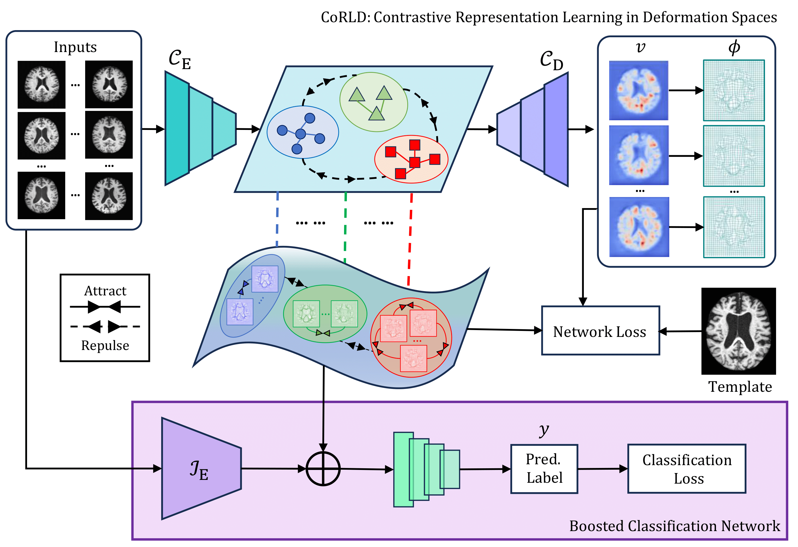
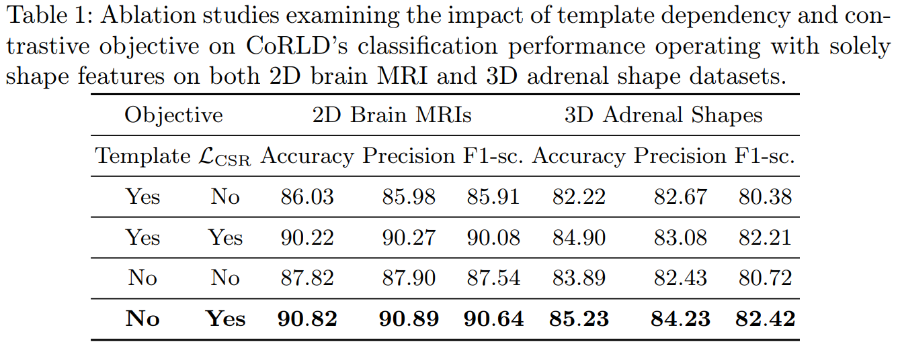
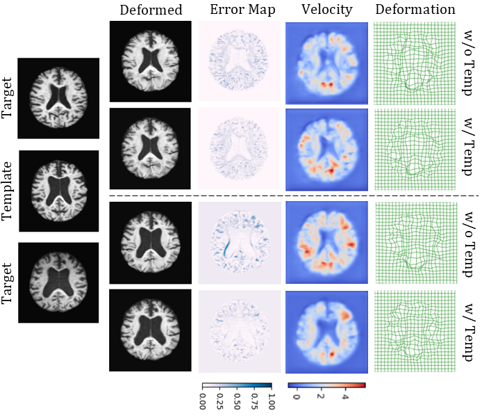

# CoRLD: Contrastive Representation Learning Of Deformable Shapes In Images
This repository provides the PyTorch implementation of the paper, ToRL.

## Abstract
Deformable shape representations, parameterized by deformations relative to a given template, have proven effective for improved image analysis tasks. However, their broader applicability is hindered by two major challenges. First, existing methods rely on a known template during testing, which is impractical and limits flexibility. Second, current approaches struggle to capture fine-grained, voxel-level distinctions between similar shapes (e.g., anatomical differences among healthy individuals, those with mild cognitive impairment, and diseased states). To address these limitations, we propose a novel framework - Contrastive Representation Learning of Deformable shapes (CoRLD) in learned deformation spaces and demonstrate its effectiveness in the context of image classification. Our CoRLD leverages a class-aware contrastive supervised learning objective in latent deformation spaces, promoting proximity among representations of similar classes while ensuring separation of dissimilar groups. In contrast to previous deep learning networks that require a reference image as input to predict deformation changes, our approach eliminates this dependency. Instead, template images are utilized solely as ground truth in the loss function during the training process, making our model more flexible and generalizable to a wide range of medical applications. We validate CoRLD on diverse datasets, including real brain magnetic resonance imaging (MRIs) and adrenal shapes derived from computed tomography (CT) scans. Experimental results show that our model effectively extracts deformable shape features, which can be easily integrated with existing classifiers to substantially boost the classification accuracy.

## CoRLD in Learned contrastive shape representations

<b> Key Takeaway 01. </b> Integrating contrastive learning significantly enhances performance under both template and template-free settings. Notably, CoRLD's template-free variant with contrastive learning achieves optimal performance ($90.82\%$), indicating that template dependency can be effectively eliminated while maintaining robust shape-based classification through contrastive feature learning.

<b> Key Takeaway 02. </b> Both w/o and w/ template models achieve comparable performance, evidenced by nearly identical deformed outputs with negligible differences. The transformation fields demonstrate similar smoothness and topological properties across both approaches, indicating our model can predict anatomically plausible deformations without requiring explicit template guidance. 
